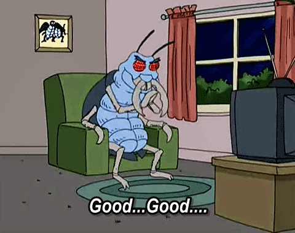

<!-- Example of title -->
<!-- Stare dzieje -->
<!-- This is a file that was created during first classes on Markdown. Think of it as a very rough sketchbook. -->
This works<!-- omit in toc -->
===
<b>wowow</b> 

<i>does this work?</i> 

<u>Git? Ale nie działa w podglądzie w internecie</u>

<!-- Here comes the table of content -->
Spis of content  
- [Links and images](#links-and-images)
  - [Links](#links)
  - [Images](#images)

- [Links and images](#links-and-images)
  - [Blinks](#links)
  - [Images](#images)

- [Links and images](#links-and-images)
  - [Links](#links)
  - [Images](#images)

- [Links and images](#links-and-images)
  - [Links](#links)
  - [Images](#images)

<!-- Example of paragraph of text with line break -->
This will surely work, won't it?
<!-- Example of another paragraph -->
Chlorem  
ipsum,

sit color 
 ament
<!-- Example of bold -->
**boldly go**
__Gitaxian probe__

<!-- Example of italic  -->
*italicly go*  
_Gitaxian probe_

<!-- Example of strikethrough -->
~~Cross out really~~ działa.
<!-- Example of headers -->
# Links and images

## Links
<!-- Example of external link -->
[Translatorion](https://translatorion.com/)  

<!-- Example of link to another file -->
[Addition](README.md)
<!-- Example of an image -->
## Images

<!-- Example of an image with hover text -->

<!-- Example of equation or inline code -->

<!-- Example of a block of code -->

<!-- Example of code highlighting -->

<!-- Example of quote -->

<!-- Example of bullet list -->

<!-- Example of numbered list -->

<!-- Example of table -->
| No. | Name    | Surname                              |
| --- | ------- | ------------------------------------ |
| 1   | Tony    | Stark                                |
| 2   | Stephen | **Strange**                          |
| 3   | Steve   | <u>Rogers</u>
is Captain
America |
| 4   | Bruce   | Banner                               |
| 5   | Kamala  | Khan                                 |

Will it work? Yes, it will.
<!-- Paragraph after table -->

Check
